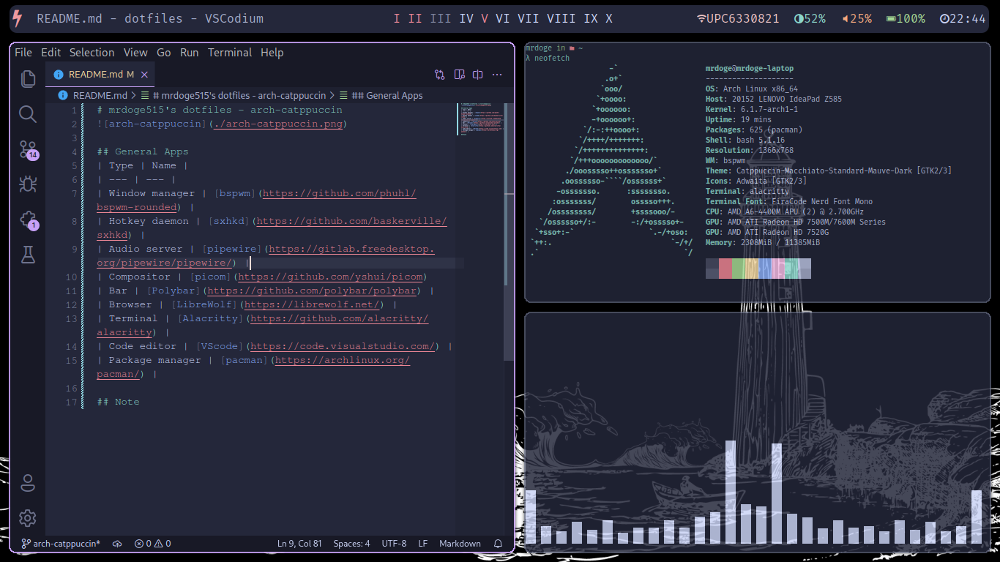

# mrdoge515's dotfiles - arch-catppuccin

## General Apps
| Type | Name |
| --- | --- |
| Window manager | [bspwm](https://github.com/phuhl/bspwm-rounded) |
| Hotkey daemon | [sxhkd](https://github.com/baskerville/sxhkd) |
| Audio server | [pipewire](https://gitlab.freedesktop.org/pipewire/pipewire/) |
| Compositor | [picom](https://github.com/yshui/picom)
| Bar | [Polybar](https://github.com/polybar/polybar) |
| Browser | [LibreWolf](https://librewolf.net/) |
| Terminal | [Alacritty](https://github.com/alacritty/alacritty) |
| Code editor | [VScode](https://code.visualstudio.com/) |
| Package manager | [pacman](https://archlinux.org/pacman/) |

## Info
The color scheme is fully based on [catppuccin](https://github.com/catppuccin/catppuccin)